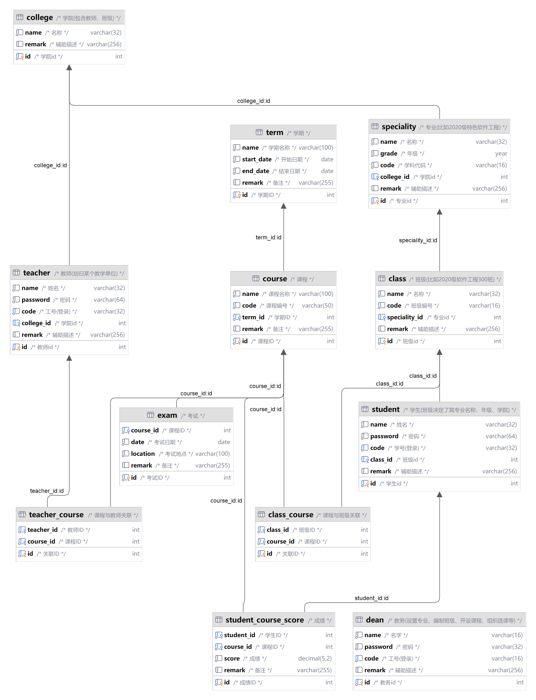
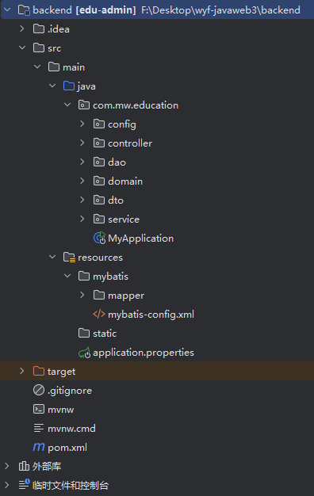
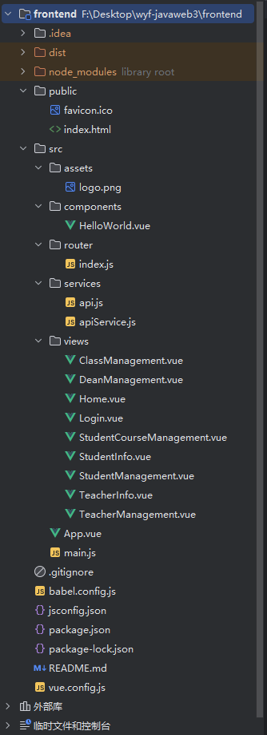

# 教务管理系统

基于 SSM (Spring、Spring MVC、MyBatis) 框架的教务管理系统，涵盖学生管理、教师管理、班级管理、课程管理、考试管理和成绩管理等功能模块。

## 项目简介

本项目旨在设计和实现一个基于 SSM 框架的教务管理系统后端。系统能够实现高效的数据库操作、清晰的业务逻辑分层和灵活的扩展性。前端使用 Vue.js 框架，结合 Element Plus 组件库进行开发。

## 技术栈

### 后端技术
- Spring Boot
- Spring MVC
- MyBatis
- Lombok

### 前端技术
- Vue.js
- Vue Router
- Element Plus

### 数据库
- MySQL

## 功能特性

- 学院、教务、专业、班级、学生、教师、课程、考试及成绩管理
- 用户登录与权限管理
- 多表联合查询，显示综合信息
- 数据库访问使用 MyBatis
- 支持 RESTful API

## 目录结构

### 数据库关系



### 后端目录结构



### 前端目录结构



## 安装与运行

### 后端

1. 克隆项目代码：

   ```bash
   git clone https://github.com/Kangwenqiao/wyf-javaweb3.git
   cd wyf-javaweb3/backend

2. 导入数据库：

   将 `database.sql` 文件导入到你的 MySQL 数据库中。

3. 配置数据库连接：

   修改 `src/main/resources/application.properties` 文件中的数据库连接配置。

4. 运行项目：

   使用 IDE（如 IntelliJ IDEA）或命令行运行 Spring Boot 项目：

   ```bash
   mvn spring-boot:run
   ```

### 前端

1. 进入前端项目目录：

   ```bash
   cd wyf-javaweb3/frontend
   ```

2. 安装依赖：

   ```bash
   npm install
   ```

3. 运行项目：

   ```bash
   npm run serve
   ```

## 使用示例

1. **用户登录**：

   访问 `http://localhost:7000/login`，使用管理员账号登录。

2. **学院管理**：

   访问 `http://localhost:7000/college-management`，进行学院的增删改查操作。

3. **教师管理**：

   访问 `http://localhost:7000/teacher-management`，进行教师的管理和课程分配。

4. **学生管理**：

   访问 `http://localhost:7000/student-management`，进行学生的管理和课程分配。

## 许可证

本项目采用 MIT 许可证。详细信息请参阅 [LICENSE](LICENSE) 文件。